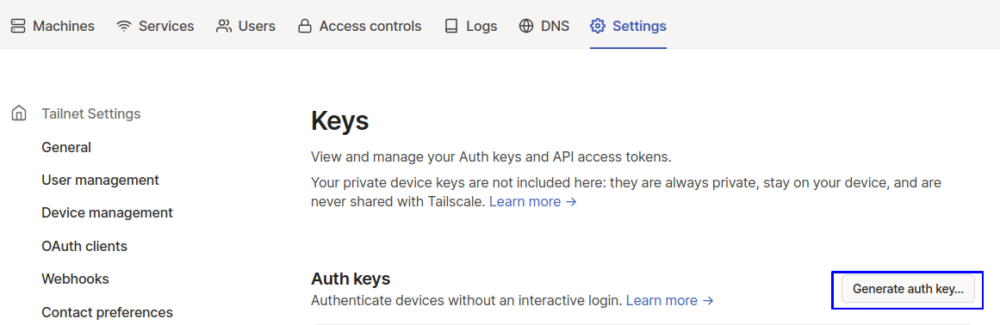
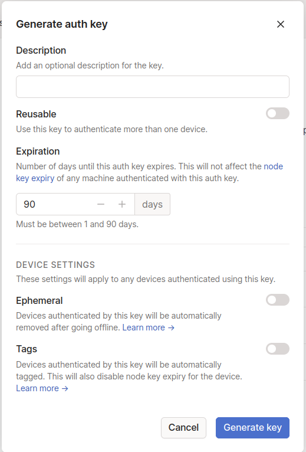
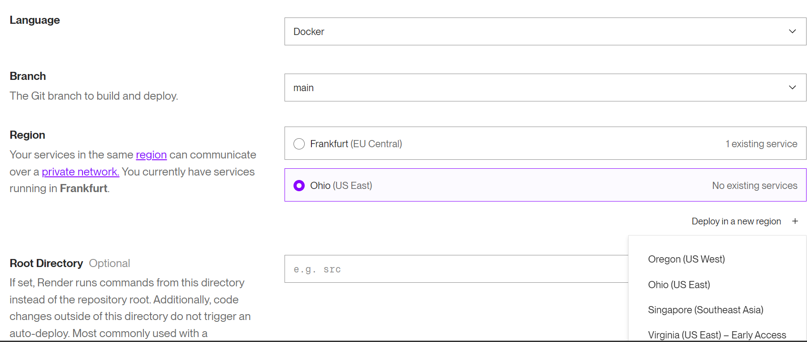
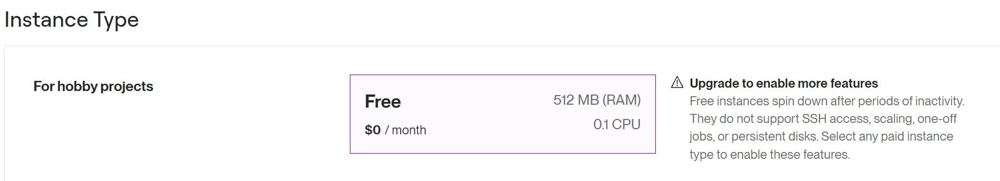
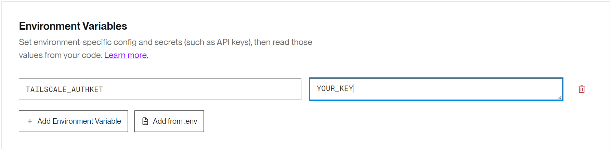
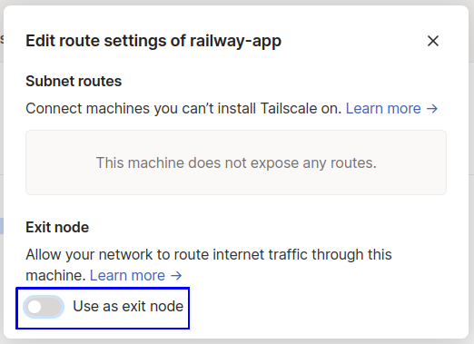
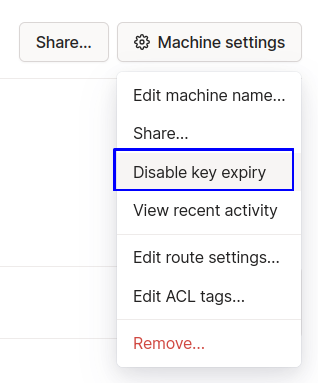
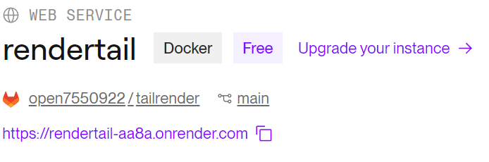

# Tailscale VPN on PaaS
[Tailscale VPN](https://tailscale.com) on PaaS hostings such as railway, render, back4app and etc.

### [!] Please, read this
This repository was created as a fork of https://github.com/render-examples/tailscale/ and https://github.com/Andrew-Bekhiet/railway_tailscale_vpn

# Setup manually

1. To get started, you should create an account on [tailscale](https://tailscale.com), if you already have an account skip to next step

2. Go to you tailscale admin console settings then to [keys](https://login.tailscale.com/admin/settings/keys)

3. Click on 'Generate auth key ...'

    

4. Give you key a description then click 'Generate key' when you are finished

    

    Remember to take a note of the key because you'll see it only once

5. Go to [render](https://render.com), choose region and set Docker as a language

    

6. Set free instance type

    

7. create TAILSCALE_AUTHKEY variable with your authkey as a value in enviroment variables and deploy.
    
    

8. Go to your tailscale machines and approve railway-app as an exit node

    

9. Disable key expiry for the machine you just deployed

    

10. Click copy to clipboard, then create a monitor on [uptimerobot](https://uptimerobot.com) to keep your service alive 24/7.
    
    

<pre></pre>

### [!] This method works with [back4app](https://back4app.com) and other PaaS like [render](https://render.com) too.